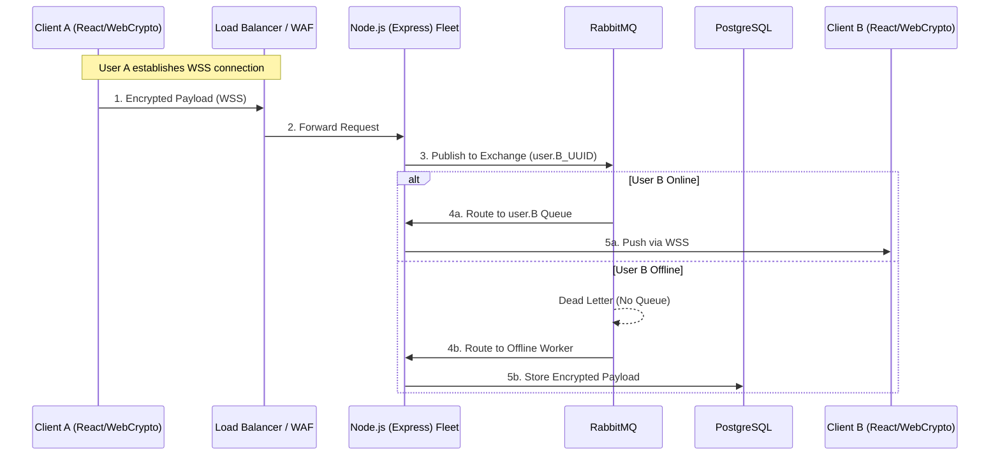
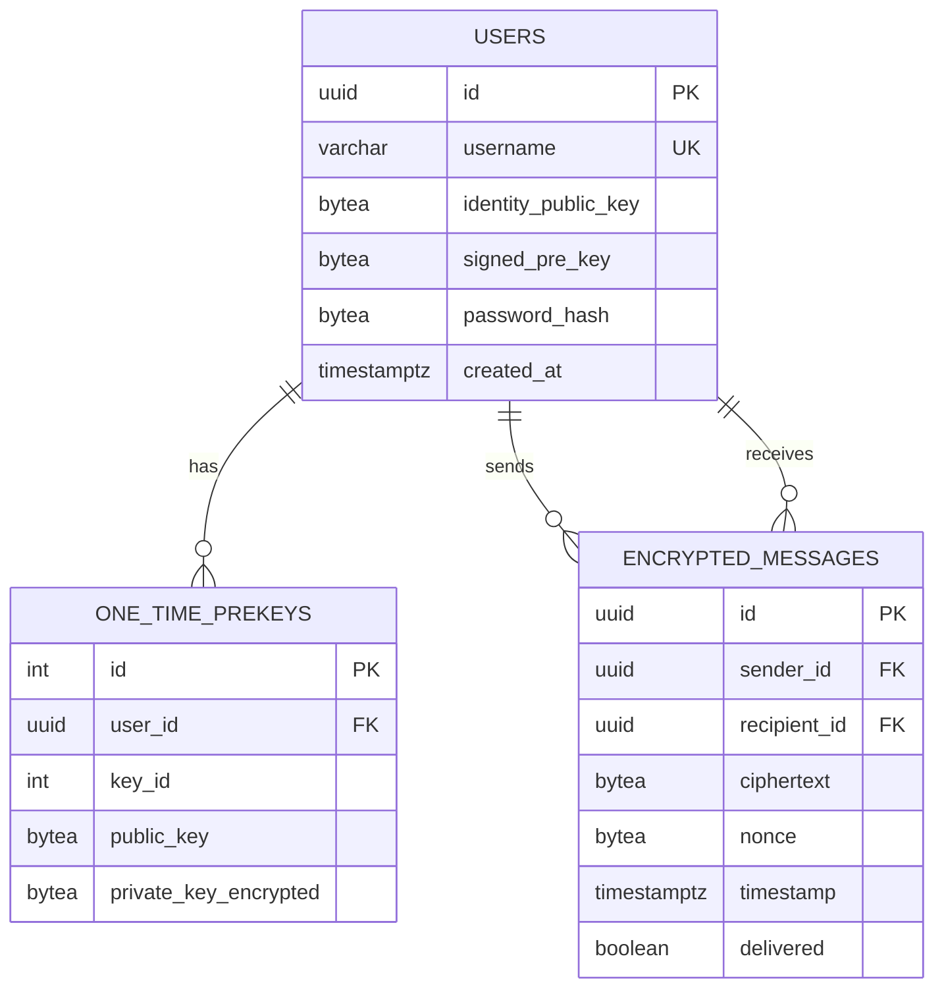

# ECHO-KNIGHT - MASTER EXECUTION PLAN
**CLASSIFICATION:** RESTRICTED | **STATUS:** MERGED V1 | **ARCHITECT:** LEAD SECURITY ENGINEER

---

## EXECUTIVE SUMMARY
This document merges the architectural blueprint from plan2.md with the enhanced development roadmap from plan3.md. It outlines a highly secure, real-time, 1-on-1 End-to-End Encrypted (E2EE) communication platform under a "Zero-Trust" paradigm: the server acts strictly as a blind relay, incapable of inspecting, decrypting, or altering message payloads or file transfers. The UI adheres to a tactical, high-contrast, military-grade "Dark Knight" aesthetic.

---

## PART I: SYSTEM ARCHITECTURE

### Technology Stack
| Layer | Technology |
|-------|------------|
| **Frontend** | React.js (JavaScript) + Web Crypto API |
| **Backend** | Node.js + Express |
| **WebSocket** | ws library |
| **Message Broker** | RabbitMQ (amqplib) |
| **Database** | PostgreSQL (pg) |
| **Cache/Session** | Redis (ioredis) |
| **Object Storage** | AWS S3 / MinIO |

### System Data Flow


### RabbitMQ Topology
```mermaid
graph TD
    subgraph RabbitMQ
    Exchange["chat.direct (Direct)"] -->|routing: user.{uuid}| Queue["User Queue (ephemeral)"]
    Exchange -->|Alternate Exchange| DLQ["Dead Letter Queue"]
    DLQ --> Worker["Offline Worker Service"]
    Worker --> DB[(PostgreSQL)]
    end
```

### Database Schema


---

## PART II: SECURITY & ENCRYPTION PROTOCOL

### Cryptographic Primitives
| Primitive | Algorithm | Purpose |
|-----------|-----------|---------|
| **Key Agreement** | X3DH (Curve25519) | Forward secrecy, cryptographic deniability |
| **Session Management** | Double Ratchet | Per-message key rotation |
| **Payload Encryption** | AES-256-GCM | Confidentiality + authentication |
| **Password Hashing** | Argon2id | Secure password storage |
| **Local Vault** | Argon2id (derived key) | IndexedDB encryption wrapper |

### Key Generation & Storage
1. Keys generated via **Web Crypto API** (`extractable: false` where supported)
2. Stored in browser **IndexedDB**
3. Vault wrapped with Argon2id-derived key from user's passphrase
4. Even with physical machine access, vault unreadable without passphrase

### Secure File Transfer Strategy
1. Client generates ephemeral **File Key (AES-256-GCM)**
2. File chunked (2MB blocks), encrypted locally
3. Upload via **pre-signed S3 URL** (server sees only binary blob)
4. Send URI + encrypted File Key via E2EE session through RabbitMQ
5. Recipient decrypts message → extracts URI + key → downloads blob → decrypts locally

---

## PART III: UI/UX - "DARK KNIGHT" PROTOCOL

### Frameworks & Libraries
| Category | Technology |
|----------|------------|
| CSS | Tailwind CSS |
| Animations | Framer Motion |
| Icons | Lucide React |
| Typography | JetBrains Mono / Fira Code (metadata), Inter (body) |

### Aesthetic Rules
- **Backgrounds:** `#09090B` (Deep Vantablack), `#18181B` (Charcoal)
- **Accents:** Phosphor Green (`#39FF14`) - active states, Cyan (`#00FFFF`) - data, Crimson (`#DC143C`) - alerts

### Layout Structure
- **Login Screen:** Minimalist terminal interface, blinking cursor, "sonar scan" animation on vault decryption
- **Main Interface:**
  - **Left Panel:** Encrypted Contact Index (glowing status dots)
  - **Center Panel:** Comms Stream (terminal-style, scramble animation on decrypt)
  - **Right Panel (Collapsible):** Crypto Metadata (session fingerprint, WSS latency)

---

## PART IV: MERGED DEVELOPMENT ROADMAP

```mermaid
%%{init: {'theme': 'dark', 'themeVariables': { 'primaryColor': '#1e1e2f', 'primaryTextColor': '#fff', 'primaryBorderColor': '#f59e0b'}}}%%
flowchart TB
    classDef sprint fill:#1e1e2f,stroke:#f59e0b,stroke-width:3px,color:#fff
    classDef task fill:#2d2d3f,stroke:#64748b,stroke-width:1px,color:#cbd5e1
    classDef testing fill:#1e1e2f,stroke:#8b5cf6,stroke-width:2px,color:#fff
    classDef cicd fill:#1e1e2f,stroke:#ec4899,stroke-width:2px,color:#fff
    classDef observability fill:#1e1e2f,stroke:#06b6d4,stroke-width:2px,color:#fff
    classDef security fill:#1e1e2f,stroke:#ef4444,stroke-width:2px,color:#fff

    subgraph S1["🔶 SPRINT 1: CORE INFRASTRUCTURE & FOUNDATION"]
        direction TB
        S1T1["1.1 Monorepo Setup (packages/, apps/)"]:::task
        S1T2["1.2 Docker-Compose (PG, RabbitMQ, Redis, MinIO)"]:::task
        S1T3["1.3 Config Management (dotenv)"]:::task
        S1T4["1.4 Structured Logging (Pino)"]:::observability
        S1T5["1.5 Health Endpoints (/health, /ready)"]:::observability
        S1T6["1.6 Rate Limiting (express-rate-limit)"]:::security
        S1T1 --> S1T2 --> S1T3 --> S1T4 --> S1T5 --> S1T6
    end

    subgraph S2["🔶 SPRINT 2: TESTING INFRASTRUCTURE"]
        direction TB
        S2T1["2.1 Jest + Supertest Setup"]:::testing
        S2T2["2.2 Test Utilities (factories, mocks)"]:::testing
        S2T3["2.3 Unit Tests: Auth Module"]:::testing
        S2T4["2.4 Integration Tests: API Endpoints"]:::testing
        S2T5["2.5 CI Test Script"]:::cicd
        S2T1 --> S2T2 --> S2T3 --> S2T4 --> S2T5
    end

    subgraph S3["🔶 SPRINT 3: GITLAB CI/CD PIPELINE"]
        direction TB
        S3T1[".gitlab-ci.yml: Lint (ESLint)"]:::cicd
        S3T2[".gitlab-ci.yml: TypeCheck"]:::cicd
        S3T3[".gitlab-ci.yml: Test (Jest)"]:::cicd
        S3T4[".gitlab-ci.yml: Build"]:::cicd
        S3T5[".gitlab-ci.yml: Security Scan (npm audit)"]:::cicd
        S3T1 --> S3T2 --> S3T3 --> S3T4 --> S3T5
    end

    subgraph S4["🔶 SPRINT 4: IDENTITY & KEY MANAGEMENT"]
        direction TB
        S4T1["4.1 Express Setup + PG Pool"]:::task
        S4T2["4.2 DB Migrations (node-pg-migrate)"]:::task
        S4T3["4.3 User Registration (public key bundles)"]:::task
        S4T4["4.4 Login (Argon2id + JWT)"]:::task
        S4T5["4.5 Redis Token Denylist"]:::task
        S4T6["4.6 One-Time PreKey API Endpoints"]:::task
        S4T1 --> S4T2 --> S4T3 --> S4T4 --> S4T5 --> S4T6
    end

    subgraph S5["🔶 SPRINT 5: CLIENT-SIDE CRYPTO & E2EE"]
        direction TB
        S5T1["5.1 React/Vite Project Setup"]:::task
        S5T2["5.2 WebCrypto API Integration"]:::task
        S5T3["5.3 IndexedDB Local Vault (Argon2id)"]:::task
        S5T4["5.4 X3DH Key Agreement Implementation"]:::task
        S5T5["5.5 Double Ratchet Algorithm"]:::task
        S5T6["5.6 Crypto Unit Tests"]:::testing
        S5T1 --> S5T2 --> S5T3 --> S5T4 --> S5T5 --> S5T6
    end

    subgraph S6["🔶 SPRINT 6: REAL-TIME WEBSOCKET & RABBITMQ"]
        direction TB
        S6T1["6.1 Express-WebSocket Integration"]:::task
        S6T2["6.2 WSS Heartbeat/Ping-Pong + Reconnection"]:::task
        S6T3["6.3 RabbitMQ Producer/Consumer"]:::task
        S6T4["6.4 Online Message Flow (WSS→MQ→WSS)"]:::task
        S6T5["6.5 Offline Worker + DLQ Handling"]:::task
        S6T6["6.6 Input Validation (Zod)"]:::security
        S6T1 --> S6T2 --> S6T3 --> S6T4 --> S6T5 --> S6T6
    end

    subgraph S7["🔶 SPRINT 7: DARK KNIGHT UI & FILE SHARING"]
        direction TB
        S7T1["7.1 Tailwind + Framer Motion Setup"]:::task
        S7T2["7.2 Dark Knight Aesthetic Components"]:::task
        S7T3["7.3 File Chunking (AES-256-GCM)"]:::task
        S7T4["7.4 S3 Pre-signed URL Upload"]:::task
        S7T5["7.5 File Metadata via RabbitMQ"]:::task
        S7T6["7.6 E2E Tests: Full Lifecycle"]:::testing
        S7T1 --> S7T2 --> S7T3 --> S7T4 --> S7T5 --> S7T6
    end

    subgraph S8["🔶 SPRINT 8: HARDENING & PRODUCTION"]
        direction TB
        S8T1["8.1 Security Headers (CORS, CSP, HSTS)"]:::security
        S8T2["8.2 Audit Logging (sensitive ops)"]:::observability
        S8T3["8.3 Retry Logic with Backoff"]:::task
        S8T4["8.4 Key Rotation Strategy (Future)"]:::task
        S8T5["8.5 Security Audit"]:::task
        S8T6["8.6 Deployment + Container Images"]:::cicd
        S8T1 --> S8T2 --> S8T3 --> S8T4 --> S8T5 --> S8T6
    end

    S1 --> S2 --> S3 --> S4 --> S5 --> S6 --> S7 --> S8
```



---

## Legend

| Color | Category |
|-------|----------|
| 🟠 Orange | Sprint containers |
| 🔵 Gray | Standard tasks |
| 🟣 Purple | Testing |
| 🩷 Pink | CI/CD |
| 🩵 Cyan | Observability |
| 🔴 Red | Security |

---

## Sprint Breakdown

### Sprint 1: Core Infrastructure & Foundation
| Task | Description |
|------|-------------|
| 1.1 | Monorepo setup (packages/, apps/) |
| 1.2 | Docker-Compose: PostgreSQL, RabbitMQ, Redis, MinIO |
| 1.3 | Config management (dotenv + config package) |
| 1.4 | Structured logging (Pino) |
| 1.5 | Health check endpoints (/health, /ready) |
| 1.6 | Rate limiting (express-rate-limit) |

### Sprint 2: Testing Infrastructure
| Task | Description |
|------|-------------|
| 2.1 | Jest + Supertest setup |
| 2.2 | Test utilities (factories, mocks, fixtures) |
| 2.3 | Unit tests: Auth module |
| 2.4 | Integration tests: API endpoints |
| 2.5 | CI test script (npm run test:ci) |

### Sprint 3: GitLab CI/CD Pipeline
| Task | Description |
|------|-------------|
| 3.1 | .gitlab-ci.yml: Lint stage (ESLint) |
| 3.2 | .gitlab-ci.yml: TypeCheck stage |
| 3.3 | .gitlab-ci.yml: Test stage (Jest) |
| 3.4 | .gitlab-ci.yml: Build stage |
| 3.5 | .gitlab-ci.yml: Security scan (npm audit) |

### Sprint 4: Identity & Key Management
| Task | Description |
|------|-------------|
| 4.1 | Express setup + PostgreSQL connection pool |
| 4.2 | Database migrations (node-pg-migrate) |
| 4.3 | User registration (public key bundles) |
| 4.4 | Login with Argon2id + JWT issuance |
| 4.5 | Redis token denylist |
| 4.6 | One-Time PreKey API endpoints |

### Sprint 5: Client-Side Crypto & E2EE
| Task | Description |
|------|-------------|
| 5.1 | React/Vite project setup |
| 5.2 | WebCrypto API integration |
| 5.3 | IndexedDB local vault (Argon2id wrapped) |
| 5.4 | X3DH key agreement implementation |
| 5.5 | Double Ratchet algorithm |
| 5.6 | Crypto unit tests |

### Sprint 6: Real-Time WebSocket & RabbitMQ
| Task | Description |
|------|-------------|
| 6.1 | Express-websocket integration |
| 6.2 | WSS heartbeat/ping-pong + reconnection logic |
| 6.3 | RabbitMQ producer/consumer |
| 6.4 | Online message flow (WSS → MQ → WSS) |
| 6.5 | Offline worker + DLQ handling |
| 6.6 | Input validation (Zod) |

### Sprint 7: Dark Knight UI & File Sharing
| Task | Description |
|------|-------------|
| 7.1 | Tailwind + Framer Motion setup |
| 7.2 | Dark Knight aesthetic components |
| 7.3 | Secure file chunking (AES-GCM) |
| 7.4 | S3 pre-signed URL upload |
| 7.5 | File metadata via RabbitMQ |
| 7.6 | E2E tests: Full message lifecycle |

### Sprint 8: Hardening & Production Readiness
| Task | Description |
|------|-------------|
| 8.1 | Security headers (CORS, CSP, HSTS) |
| 8.2 | Audit logging for sensitive operations |
| 8.3 | Retry logic with backoff |
| 8.4 | Key rotation strategy (future) |
| 8.5 | Security audit |
| 8.6 | Deployment + container images |

---

## GitLab CI/CD Structure

```yaml
# .gitlab-ci.yml
stages:
  - lint
  - typecheck
  - test
  - build
  - security
  - deploy

lint:
  stage: lint
  script: npm run lint

typecheck:
  stage: typecheck
  script: npm run typecheck

test:unit:
  stage: test
  script: npm run test:unit

test:integration:
  stage: test
  script: npm run test:integration

build:
  stage: build
  script: npm run build

security:audit:
  stage: security
  script: npm audit --audit-level=high
```

---

## Key Integrations from Merged Plans

| Source | Integrated Content |
|--------|---------------------|
| **plan2.md** | Full E2EE architecture (Signal Protocol), X3DH/Double Ratchet, PostgreSQL schema, RabbitMQ topology, Dark Knight UI aesthetic, file transfer strategy |
| **plan3.md** | 8-sprint structure, Jest/Supertest, GitLab CI/CD, Pino logging, health checks, rate limiting, Zod validation, observability |

---

## Next Steps

1. Review the merged plan
2. Begin **Sprint 1** implementation when ready

---

Ready to begin implementation?

https://opncd.ai/share/J6ubDcYj