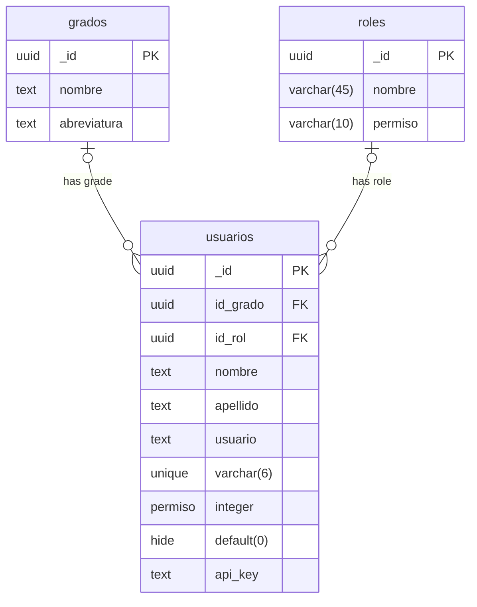

```mermaid
erDiagram
    grados {
        uuid _id PK
        text nombre
        text abreviatura
    }
    roles {
        uuid _id PK
        varchar(45) nombre
        varchar(10) permiso
    }
    usuarios {
        uuid _id PK
        uuid id_grado FK
        uuid id_rol FK
        text nombre
        text apellido
        text usuario unique
        varchar(6) permiso
        integer hide default(0)
        text api_key
    }
    grados |o--o{ usuarios : "has grade"
    roles |o--o{ usuarios : "has role"

```